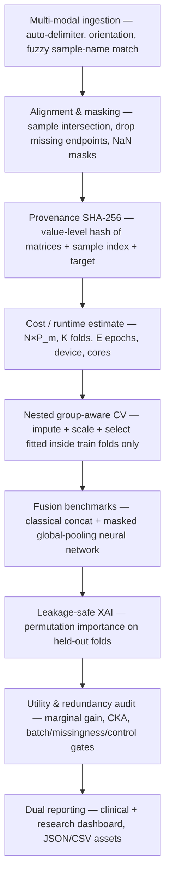

# omicau — Omics Audit

A reproducible, leakage-safe, platform-agnostic command-line tool that audits
multi-omic datasets: it ingests non-standardized matrices, aligns them, locks
their provenance with a value-level cryptographic hash, tests for missingness
bias and batch effects, benchmarks classical and neural data-fusion models under
group-aware cross-validation, attributes predictive signal to individual
features, and compiles an interactive dual clinical/research dashboard alongside
machine-readable JSON/CSV assets.

The core runs fully offline with no LLM connection and no orchestration
framework. Optional tiers (an LLM interpretation plugin, remote data hubs)
degrade gracefully when their dependencies or network are absent.

📖 **Documentation:** https://tunabirgun.github.io/omicau/

---

## What it answers

For a set of omic layers and a clinical endpoint, omicau answers three questions:

1. **Does combining the layers actually help,** or does one layer already carry
   the signal? (marginal gain from adding each modality)
2. **Is the data trustworthy,** or is the apparent signal an artifact of batch
   effects, target-linked missingness, or information leakage? (adversarial
   diagnostics + control baselines)
3. **What drives the prediction,** biologically? (leakage-safe feature
   attribution)

The four design pillars are universality (runs out of the box on laptops, Apple
Silicon, Intel, and headless HPC nodes; MPS/CUDA/CPU auto-selected), reproducibility
(seeded loops, pinned versions, an immutable data hash), usability (a dual
clinical/research dashboard), and scientific validity (leakage prohibition,
masked missing-value handling, control baselines).

---

## Installation

```bash
pip install .                 # core, fully offline
pip install ".[llm]"          # + LLM verdict plugin (Claude / ChatGPT / Gemini / local)
pip install ".[data]"         # + remote data hubs (requests, google-cloud-storage, cptac)
pip install ".[ui]"           # + optional local no-code web UI (FastAPI + uvicorn)
pip install ".[all,dev]"      # everything + pytest
```

Python ≥ 3.10. Core dependencies: `numpy`, `pandas`, `scipy`, `scikit-learn`,
`torch`, `plotly`, `click`, `jinja2`, `tqdm`.

## Quickstart

```bash
omicau check-env                                   # CPU/GPU + dependency status
omicau bootstrap --dataset mock --out-dir demo     # write a synthetic dataset
omicau run --config demo/config.json --cores 8     # full audit -> demo/run/report.html
omicau verify --config demo/config.json            # recompute the provenance hash
```

Open `demo/run/report.html` for the dashboard; `demo/run/audit.json` and the
`*.csv` files are the machine-readable assets.

### Optional no-code web UI

omicau is a CLI tool first. For non-coders there is an opt-in local UI:

```bash
pip install ".[ui]"
omicau ui                     # opens a browser wizard on 127.0.0.1
```

`omicau ui` starts a local, single-user server (auto-selected free port, bound to
`127.0.0.1` behind a one-time token), opens a browser, and walks you through a
wizard: drop your files (**or load a public cohort from a data hub** — TCGA, Xena,
CCLE, CPTAC, OpenPBTA, Expression Atlas, Metabolomics Workbench, or an offline
synthetic demo, via the same connectors the CLI `bootstrap` uses), confirm the
auto-guessed omic role and orientation of each, map the clinical columns (target /
patient-group / batch — each shows its live consequence, e.g. class balance or the
leakage implication of the grouping), check cross-file alignment, optionally add a
plain-language AI verdict (**Claude, ChatGPT, Gemini, or a local model** — the API
key stays in memory for that one run and is never stored), then run the identical
`run_audit` pipeline and read the report in-page. **All data stays on the machine —
nothing is uploaded.** The UI only builds the config and shows the result; it never
re-implements the science, so the CLI and UI always give the same answer.

For a no-install experience, a **desktop app** (double-click → opens the UI) can
be packaged from [`packaging/`](packaging/): a PyInstaller onedir bundle with a
private CPU-only PyTorch runtime, wrapped as a signed Windows installer (Inno
Setup), a Linux AppImage, and a notarized macOS (arm64) `.dmg`, built per-OS in
CI (`.github/workflows/release.yml`). See `packaging/README.md` for sizes and
signing. HPC/headless clusters use the `pip` package + CLI, not the GUI.

### Verifying a run's provenance hash

Every run prints and stores a SHA-256 hash of the aligned data. It is
deterministic, so anyone can recompute it from the same inputs and confirm no
drift:

```bash
omicau verify --config demo/config.json --expected <hash>   # exit 1 on mismatch
omicau verify --config demo/config.json --audit demo/run/audit.json  # compare stored vs recomputed
```

---

## Use your own data

The remote data hubs are optional shortcuts; **the primary workflow is to point
omicau at your own matrices.** You provide one file per omic modality, one
clinical table with the outcome, and a small config that names them.

Ingestion is deliberately forgiving, so you rarely have to reshape anything:

- **Delimiter** is auto-detected (comma, tab, semicolon, or whitespace).
- **Orientation** is auto-detected by sample-id overlap — a `samples × features`
  matrix and a `features × samples` matrix (e.g. genes-as-rows expression) both work.
- **Sample names** are fuzzily matched across files (whitespace, case, and common
  batch/aliquot suffixes are normalized).
- Dirty headers, mixed whitespace, common NA tokens (`NA`, `null`, `.`, `?`, …),
  European decimals, and `±inf` are healed automatically.
- Missing values stay masked — never imputed at ingest.

Minimal layout (any of CSV/TSV; matrices can be either orientation):

```
mystudy/
  rna.csv          # samples × genes  (or genes × samples — auto-detected)
  protein.csv      # samples × proteins
  clinical.csv     # one row per sample: sample_id, outcome[, patient_id, batch]
  config.json
```

`config.json` (JSON shown; `.toml` and `.yaml` are also accepted):

```json
{
  "run_name": "my_study",
  "output_dir": "run",
  "modalities": [
    {"name": "rna",     "path": "rna.csv",     "description": "RNA-seq log-TPM"},
    {"name": "protein", "path": "protein.csv", "description": "Proteomics"}
  ],
  "clinical": {
    "path": "clinical.csv",
    "target": "outcome",
    "sample_id": "sample_id",
    "group": "patient_id",
    "batch": "batch",
    "task": "auto"
  },
  "cv": {"n_splits": 5, "seed": 42},
  "neural": {"enabled": true, "epochs": 60},
  "llm": {"enabled": false}
}
```

```bash
omicau run --config mystudy/config.json --cores 8
```

Field notes:

- **`sample_id`** — the clinical column holding sample identifiers (omit to use the
  table's first column / index). The same ids must appear (after normalization) in
  each modality matrix; samples are intersected across all files.
- **`target`** — the clinical column to predict. `task: "auto"` infers
  classification vs regression; set `"classification"`, `"regression"`, or
  `"survival"` to force it.
- **`time`** / **`event`** (survival only) — for `task: "survival"`, the numeric
  time-to-event column and the event indicator (1 = event, 0 = right-censored);
  `target` is ignored. Scored by Harrell's concordance index.
- **`group`** (optional, recommended) — a column such as patient id, so multiple
  samples from one patient never split across train and test (leakage-safe CV).
  Accepts a **list** of columns (e.g. `["animal", "run"]`) that combine into the
  coarsest independent unit for nested / repeated-measure designs.
- **`batch`** (optional) — a column such as sequencing batch or site; drives the
  batch-effect diagnostics (and the opt-in `cv.batch_blocked` cross-site stress
  test and `cv.batch_adjust_sensitivity` in-fold sensitivity probe).
- Only rows with a non-missing target are kept. Paths are resolved **relative to the
  config file**, so keep the config next to your matrices.

Start from a working template by generating the mock dataset and editing its
`config.json` + CSV headers to match your files:

```bash
omicau bootstrap --dataset mock --out-dir template   # writes a runnable config.json + example CSVs
```

Add as many modalities as you like (methylation, metabolomics, CNV, …). A single
modality is allowed — the audit simply skips the cross-modality comparisons.

### Input format for each omics layer

Every modality is a single **sample × feature numeric matrix**: identifiers live
in the header row and the index column, and the body is numbers only (blanks or
`NA`/`null`/`.` for missing). omicau does not care which normalization you used —
it standardizes inside each cross-validation fold — but the values must be numeric
and comparable within a column. The table below is guidance, not a hard schema;
the ingester auto-detects delimiter and orientation, so any of these read as-is.

| Omics layer | Matrix body (value type) | Feature id (columns) | Notes for omicau |
| --- | --- | --- | --- |
| **RNA-seq / expression** | log-normalized expression (log2 TPM/FPKM/CPM, or RSEM/`log2(x+1)`) | gene symbol / Ensembl / Entrez | Prefer a log scale; raw counts work but log-transform heavy-tailed counts first. One value per gene per sample. |
| **Proteomics** | normalized abundance / intensity (usually log2) | UniProt id or gene symbol | Missing values are common and informative (MNAR) — leave them blank/`NA`, do **not** impute. Collapse isoforms to one column per protein. |
| **DNA methylation** | beta values in `[0,1]` **or** M-values | Illumina probe id (cg…) or gene | Beta and M are both fine as numeric features; don't mix the two in one matrix. |
| **Metabolomics** | peak area / concentration (often log-transformed) | metabolite name / RefMet / HMDB id | Keep below-detection as blank/`NA`. One column per metabolite. |
| **Copy number (CNV)** | log2 copy-ratio (continuous) **or** GISTIC discrete `-2…2` | gene symbol | Either continuous or integer levels; keep one convention per matrix. |
| **miRNA** | log-normalized expression | miRBase id (hsa-miR-…) | Same shape as RNA-seq. |
| **Somatic mutation** | binary `0/1` (mutated) or a mutation count | gene symbol | Presented as numeric features; a near-constant column (almost all 0) is dropped automatically. |

Universal rules across layers:

- **One file per modality**, samples aligned by id across all files and the
  clinical table. Feature names must be unique within a modality; the same name in
  two modalities is fine (omicau namespaces them as `modality::feature`).
- **Do not pre-impute or pre-scale.** Missing entries stay masked (the neural fuser
  ignores them; classical models median-impute inside the training fold only), and
  standardization happens inside each fold — pre-scaling across all samples leaks.
- **Log-transform skewed counts** (RNA-seq/miRNA/metabolomics) before ingest;
  omicau standardizes but does not log for you.
- **Orientation and delimiter are auto-detected**, so genes-as-rows or
  samples-as-rows, CSV or TSV, all load without a flag.

---

## Workflow



---

## Methodology

### 1. Flexible ingestion and alignment

Matrices lack a standard layout, so ingestion adapts per file:

- **Delimiter** is inferred with `csv.Sniffer`, falling back to header-frequency
  counting across the candidate set `{tab, comma, semicolon, pipe}` and to
  whitespace splitting.
- **Orientation** is resolved by overlap scoring. For a matrix with row labels
  `R` and column labels `C`, and reference sample ids `S`, the fraction of each
  axis that matches the reference is `overlap(L, S) = |normalize(L) ∩ S| / |L|`.
  If `overlap(C, S) > overlap(R, S)` the matrix is transposed so samples are
  rows. This automatically corrects genes-as-rows expression matrices.
- **Fuzzy sample-name normalization** strips whitespace, upper-cases, and removes
  configurable prefix/suffix regexes. The default suffix rule collapses a TCGA
  aliquot barcode to its patient stem.
- **Numeric self-repair** coerces text columns, masks common NA tokens
  (`NA`, `null`, `.`, `?`, …), heals European decimals by comparing the
  parse yield of the raw text vs a `1.234,5 → 1234.5` repair and keeping the
  interpretation that recovers more finite values, and maps ±∞ to `NaN`.
- Samples are **intersected** across all modalities and the clinical table;
  records with a missing endpoint are dropped; duplicate features are namespaced
  per modality (`modality::feature`) to block cross-modality collisions.

Missing values are kept as `NaN` (true masks), never imputed at ingest.

### 2. Cryptographic provenance

Immediately after alignment, an immutable signature is computed as the SHA-256
of a canonical JSON manifest of the sorted sample index, each modality's sorted
feature list and shape, a **content digest of each aligned matrix** (the numeric
values in canonical row/column order), a digest of the encoded target, the
target name, and the task. It is tamper-evident at the value level: changing any
single measurement — not only which samples or features enter the study —
changes the hash, locking asset provenance across the study lifetime.

### 3. Missingness-bias diagnostics

Tests whether *missingness itself* carries information (missing-not-at-random):

- **Kruskal-Wallis** of each sample's per-modality missing fraction across
  outcome classes (or **Spearman** correlation for a continuous target).
- **Chi-squared** of a binary "any-missing" indicator against the outcome.
- **Kruskal-Wallis** of the missing fraction across batches.

p-values are corrected across all tests with the **Benjamini-Hochberg** FDR:
sort `p_(1) ≤ … ≤ p_(n)`, set `p̃_(i) = min_{k≥i} min(1, p_(k)·n/k)`.

### 4. Batch-effect and confounding diagnostics

Each modality is projected onto principal components (standardized;
mean-imputed for the projection only — never for modeling). Batch structure is
quantified by (i) the **silhouette** of batch labels in PC space, (ii) one-way
**ANOVA** and **Kruskal-Wallis** of PC1 across batches, and (iii) the fraction
of PC1 variance explained by batch, `η² = SS_between / SS_total`. Batch/outcome
confounding — the regime in which a batch effect masquerades as signal — is
tested with a **chi-squared** test + **Cramér's V** for a categorical target and
a one-way **ANOVA** with **η²** for a continuous (regression) target. This
confounding result, not the PC-variance structure alone, gates the
*batch-confounded* verdict.

### 5. Leakage-safe preprocessing (nested)

All preprocessing is an sklearn `Pipeline` fitted **inside each training fold
only** and applied to the held-out fold:

1. median imputation (train-fold medians),
2. zero-variance filtering,
3. standardization `z = (x − μ_train) / σ_train`,
4. optional univariate selection (`SelectKBest`, ANOVA F-test for
   classification, F-regression for regression).

No validation-fold statistic ever influences training.

### 6. Group-aware cross-validation

When a group column is present (e.g. patient id with multiple samples), splits
keep all of a group's samples on one side, prohibiting identity leakage:
`StratifiedGroupKFold` (classification) or `GroupKFold` (regression); otherwise
`StratifiedKFold` / `KFold`. The fold count is clamped so every fold is populated
and, for classification, contains both classes. Metrics are computed on pooled
out-of-fold predictions.

### 7. Fusion benchmarks across the integration axis

omicau benchmarks three integration regimes so you can see which one a dataset
actually wants: **early** (feature concatenation, this section), **intermediate**
(the masked global-pooling neural network, §8), and **late** (stacking — a
meta-learner cross-validated over the single-modality out-of-fold predictions,
reported as `stacking::FUSION`; leakage-safe because the base predictions are
out-of-fold and the meta-learner is itself cross-validated).

Early fusion concatenates the (namespaced) modality matrices. For each estimator
— L2-regularized logistic regression / ridge, random forest, or histogram
gradient boosting — omicau cross-validates:

- each modality **alone**,
- the **full fusion**,
- each **leave-one-modality-out** subset.

The **marginal gain** of modality *m* is `Δ_m = score(FUSION) − score(FUSION∖m)`.
Because k-fold training sets overlap, its significance uses the **Nadeau–Bengio
corrected resampled *t*-test** (inflating the fold-difference variance by
`1/k + 1/(k−1)`) rather than a naive paired *t*-test, whose Type-I error is badly
inflated; the same corrected test is applied to the neural fuser's gain.

### 8. Masked Global Pooling Fusion network (PyTorch)

The custom neural fuser is agnostic to feature counts and to which features are
missing per sample. Each modality *m* has a learned per-feature embedding table
`E_m ∈ ℝ^{P_m × d}`. For a sample with standardized values `x` and observed mask
`o ∈ {0,1}^{P_m}`:

- token per feature: `t_j = E_m[j] · x_j`,
- **masked mean pooling** over observed features only:
  `pooled_m = (Σ_j o_j · t_j) / max(1, Σ_j o_j)` (a `max` variant is available),
- followed by `LayerNorm`.

Missing features (`o_j = 0`) contribute nothing to the pooled embedding — no
artificial variance is injected. Per-modality embeddings are concatenated and
passed to an MLP head (`Linear → ReLU → Dropout → Linear`). Loss is cross-entropy
(classification) or MSE (regression). Standardization statistics are computed
from the training fold only (masked over observed entries), keeping the neural
path leakage-safe. Early stopping uses an internal split of the training fold.
Training is wrapped in an out-of-memory self-repair loop that halves the batch
size, clears the device cache, and retries, then falls back to CPU.

### 9. Leakage-safe feature attribution (XAI)

Primary attribution is **permutation importance** computed on each held-out
validation fold with the model trained only on that fold's training data. The
across-fold **mean and ±SD** are reported, so an unstable (high-SD) attribution
is visible rather than hidden. This is *unconditional* permutation importance,
which over-credits correlated predictors and can split or inflate importance
among collinear features (Hooker et al. 2021; Strobl et al. 2008) — omic layers
are highly collinear, so the report flags this and the ranking should be read as
indicative, not causal. The neural fuser additionally exposes a native score from
its per-feature embedding norms weighted by observed feature variance.

### 10. Modality-utility ledger and redundancy

Representational redundancy between modalities *X* and *Y* is the linear
**centered kernel alignment**
`CKA(X, Y) = ‖YᵀX‖_F² / (‖XᵀX‖_F · ‖YᵀY‖_F) ∈ [0, 1]`
on column-standardized matrices; high CKA with a stronger-alone modality marks a
layer as redundant. Each modality receives a verdict — *predictive*, *redundant*,
*batch-confounded*, or *control-like*. A layer is called *batch-confounded* only
when its variance is batch-structured **and** batch is genuinely confounded with
the outcome; a batch effect orthogonal to the outcome is harmless and is not
flagged (Nygaard et al. 2016).

### 11. Control baselines

The identical pipeline is run on three corrupted inputs to prove it does not
leak: **shuffled target**, **column-shuffled features**, and **random Gaussian
noise**. A well-behaved harness scores at chance on all three. The leakage alarm
gates the whole ledger and is **CI-aware**: it fires when a control's bootstrap
95% CI **lower bound** clears chance (i.e. the control is *significantly* above
chance), falling back to a task-aware margin (chance + 0.12) when no CI is
available. AUPRC is reported against its prevalence baseline so lift over chance
is visible.

### 12. Metrics

Classification: AUROC, AUPRC (average precision), accuracy, balanced accuracy,
F1, Matthews correlation. Regression: R², RMSE, MAE, Spearman ρ, Pearson r.
Survival: Harrell's concordance index (a ridge-penalised Cox model with in-fold
PCA reduction; dependency-light — no scikit-survival/lifelines, so it ships in the
base install). All guard against degenerate folds and return `NaN` rather than
raising. The primary metric is AUROC (classification), R² (regression), or the
C-index (survival).

### 12b. Task types and optional capabilities

- **Survival / time-to-event** (`task: "survival"`) — Cox + C-index under the same
  leakage-safe group-aware CV, controls, and bootstrap CIs.
- **Single-modality runs** are a first-class *honesty check*: with one layer there
  is no fusion to benchmark, so the report drops the inert fusion/redundancy panels
  and verifies the single layer's signal is real and leakage-free.
- **Composite grouping** (`group: [ ... ]`) for nested / repeated-measure designs.
- **Cross-organism data** and the **Expression Atlas** hub, with an opt-in
  `--normalization tmm|median_of_ratios` (whole-matrix, caveated; `log2cpm` default).
- **Batch-adjustment sensitivity probe** (`cv.batch_adjust_sensitivity`) — an opt-in,
  in-fold "does the signal survive batch removal?" check, hard-gated off when batch
  is confounded with the outcome. It never corrects your data ("diagnose, don't
  correct").

All of the above are exposed in both the CLI/config and the no-code web UI.

Every model's primary metric carries a **group-level bootstrap 95% confidence
interval** (resampling whole patient groups, consistent with the group-aware CV);
the per-fold spread is reported only as "fold dispersion," since correlated folds
bias it low. For binary classification the report adds **calibration** — a
reliability curve, Brier score, and expected calibration error — flagging that
`class_weight="balanced"` miscalibrates the predicted probabilities by
construction.

### 13. Fairness, generalization, and governance

- **Subgroup performance** — the best model's pooled out-of-fold predictions are
  re-scored within each level of the batch/site column, and the max-minus-min
  metric gap is surfaced, since a global metric can hide subgroup disparities
  (Obermeyer et al., *Science* 2019). Pure re-aggregation, no retraining.
- **Cross-site stress test** (opt-in `cv.batch_blocked`) — the reference fusion is
  additionally cross-validated with folds **blocked on batch** (leave-one-batch-out),
  giving an honest new-batch generalization estimate and an optimism gap against
  the standard CV.
- **Governance** — a **DOME** methods block (Data / Optimization / Model /
  Evaluation, with explicit limitations; Walsh et al., *Nat Methods* 2021) is
  written into `audit.json`, and a **`MODEL_CARD.md`** (intended use = RUO audit,
  data, metrics with CIs, caveats; Mitchell et al., FAccT 2019) is emitted
  alongside the report.

### 14. Pre-flight cost estimation

Before heavy loops, wall-time is estimated from `N × P_m` per modality, the fold
count `K`, neural epochs `E`, the device (MPS/CUDA/CPU), and the core count `C`.
A single live RandomForest fit calibrates the per-fit cost on the actual machine;
it is scaled by the model/fold counts, and the neural cost is modelled from the
epoch budget and feature footprint. The estimate is deliberately conservative so
HPC allocations are safe.

---

## Reporting

- **Dashboard** (`report.html`): a single, fully offline self-contained file
  (Plotly bundled inline; fonts embedded as data URIs — zero network calls).
  Humanist sans typography (IBM Plex Sans + IBM Plex Mono), a color-blind-safe Okabe-Ito
  palette (cobalt `#0072B2` = standard, vermillion `#D55E00` = warning), an
  executive tab for PIs/clinicians and a research tab for computational
  biologists, five interactive figures, and tables that are sortable,
  text-filterable, and CSV/TSV-exportable via dependency-free vanilla JavaScript.
- **Machine-readable**: `audit.json` (full state, including a DOME methods block),
  `model_metrics.csv`, `modality_ledger.csv`, `missingness_tests.csv`, and
  `MODEL_CARD.md` (a research-use-only model card).

---

## Data hubs

All clients run structural gates (numeric-only, non-finite healing,
constant-feature dropping, sample-extension matching) and use retry-with-jitter.
Network access is optional and isolated; the core is unaffected if it is absent.

Only hubs whose live connection was verified are shipped. Each client was probed
directly against its real endpoint (the connection column reflects that check).

| Client | Source | Modalities → target | Connection |
| --- | --- | --- | --- |
| `tcga` | cBioPortal public REST API | mRNA + copy-number + merged sample/patient clinical | **verified** (`laml_tcga`: sex from RNA+CNV, AUROC ≈ 0.90) |
| `ccle` | DepMap 24Q4 (figshare) | RNA-seq → CRISPR gene-effect dependency | **verified** (1103 lines × 19k genes; SOX10 R² ≈ 0.74) |
| `xena` | UCSC Xena hubs (no auth) | RNA-seq / methylation / CNV / protein + phenotype | **verified** (TCGA-BRCA PAM50, 1247 samples) |
| `openpbta` | Public AWS S3 (anonymous) | putative-fusion matrix + histologies | **verified** (`open-targets/v15` S3 listing + TSV headers) |
| `metabolomics_workbench` | Metabolomics Workbench REST | metabolomics + study factors | **verified** (ST000009: gender AUROC ≈ 0.88) |
| `cptac` | `cptac` PyPI package | matched proteomics + transcriptomics | needs the `cptac` package (a build toolchain; no Windows/py3.12 wheel) — verified by docs only |
| `allofus` | All of Us Researcher Workbench | WGS / proteomics / RNA-seq | Workbench-only by design; off-platform it raises a clear error (cannot be externally connected) |

`gdsc` and `linkedomics` were evaluated and **dropped**: their public download
endpoints do not respond to a scripted client (HTTP 410 and 403 respectively).

The All of Us client runs only inside the secure Researcher Workbench and reads
the managed `WORKSPACE_CDR` / `WORKSPACE_BUCKET` / `GOOGLE_PROJECT` variables;
data cannot be exported and off-platform sessions raise a clear error. No
participant-level data is ever transmitted off-platform.

`omicau` was also validated on four external datasets that are **not** hubs,
spanning binary, multi-class, and regression tasks:

- **ROSMAP** (MOGONET; Alzheimer's, three omics) — fusion AUROC ≈ 0.80.
- **BRCA** (MOGONET; PAM50 subtype, three omics, 5-class) — fusion AUROC ≈ 0.95,
  with methylation and miRNA correctly flagged redundant with RNA.
- **GSE19804** (GEO microarray; lung tumor-vs-normal, 120 samples × ~54k probes) —
  AUROC ≈ 0.99.
- **GSE41037** (GEO; an epigenetic clock — whole-blood DNA methylation → age,
  720 samples × ~27.6k CpGs, **regression**) — R² ≈ 0.88, MAE ≈ 3.6 years.

Across all four, the shuffled-target / shuffled-feature / random-noise controls
scored at chance (negative R² for the regression), and no leakage was flagged.

---

## Software versions

### Frozen Python stack (development + test reference)

| Package | Version | Package | Version |
| --- | --- | --- | --- |
| Python | 3.12.10 | scikit-learn | 1.9.0 |
| numpy | 2.5.0 | torch | 2.12.1 (CPU) |
| pandas | 3.0.3 | plotly | 6.8.0 |
| scipy | 1.18.0 | click | 8.4.1 |
| jinja2 | 3.1.6 | tqdm | 4.68.3 |
| requests | 2.34.2 | pytest | 9.1.1 |

Optional tiers (pinned floors in `pyproject.toml`): `anthropic ≥ 0.39`,
`openai ≥ 1.0`, `cptac ≥ 1.5` (tested against 1.5.14),
`google-cloud-storage ≥ 2.10`, `pyyaml ≥ 6.0`. The optional plain-language verdict
is provider-agnostic: **Claude** (Anthropic Messages API, default
`claude-sonnet-5`), **ChatGPT** (OpenAI), **Gemini** (Google's OpenAI-compatible
endpoint), and **local** models (Ollama / LM Studio / vLLM) — the `openai` SDK
drives the last three. Only the audit's numeric diagnostics are sent (never raw
data); the key is used for one call and never stored.

### Upstream database / atlas releases (pinned)

| Resource | Release pinned | Route |
| --- | --- | --- |
| cBioPortal | REST API v3 (public); example study `laml_tcga` | `https://www.cbioportal.org/api` |
| DepMap / CCLE | **DepMap Public 24Q4** (figshare article 27993248) | figshare `ndownloader` |
| CPTAC | via `cptac` 1.5.14 (Zenodo-hosted, on-demand) | `cptac` cancer classes |
| OpenPedCan | **release v15** (`open-targets/v15`) | public S3 `d3b-openaccess-us-east-1-prd-pbta` |
| OpenPBTA | `release-v23-20230115` | public S3 (same bucket) |
| GDSC (optional target) | release 8.4 (24Jul22) | — |
| PRISM (optional target) | Repurposing 19Q4 | figshare article 9393293 |
| All of Us | CDR v7/v8 Workbench variable conventions | in-Workbench BigQuery + GCS |

Open-access release identifiers move over time; each client docstrings its
verified-as-of date, and the endpoints are best-effort — re-verify before
production.

---

## Reproducibility log

- **Determinism**: every stochastic step is seeded (`numpy`, `random`,
  `torch.manual_seed`; per-fold seeds derive from the master seed). Cross-validation
  splits depend only on the target, groups, and seed, so leave-one-out and
  single-vs-fusion comparisons are exactly paired. Strict bit-level determinism
  (`torch.use_deterministic_algorithms` + `CUBLAS_WORKSPACE_CONFIG`) is opt-in via
  `--deterministic` / `compute.deterministic`; it is off by default because some
  ops lack deterministic kernels (enabled with `warn_only` so it never hard-fails).
- **Provenance**: the value-level SHA-256 of the aligned matrices, sample index,
  features, and target is written to `audit.json` and re-checkable with
  `omicau verify` (exit 1 on any drift).
- **Environment capture**: `audit.json → environment` records the Python,
  platform, numpy, and torch versions of the run; `runtime_log.txt` records the
  wall-time of every step with a device tag (`hostname/device/cores`).
- **Built and tested on**: Python 3.12.10, Windows 11 (10.0.26200), x86-64
  (AMD64), CPU-only torch. The package is cross-platform (`pathlib` throughout,
  defensive `newline=""` I/O, no shell invocation) and headless-HPC ready
  (`--cores`/`--threads` honor cgroup limits; no interactive prompts).

---

## Decoupling and HPC

The `omicau` core is 100% functional with no internet access, no LLM connection,
and no multi-agent framework. The LLM interpretation layer
(`interpretation/llm_summary.py`) is an optional plugin; when absent it falls
back to a deterministic rule-based summary filling the identical JSON schema, so
the report never breaks. Remote data hubs are optional and isolated behind lazy
imports. Thread/worker counts are set explicitly via `--cores` / `--threads`;
the PyTorch device is chosen with `--device` (MPS/CUDA/CPU, `auto` by default).

---

## License

MIT.
